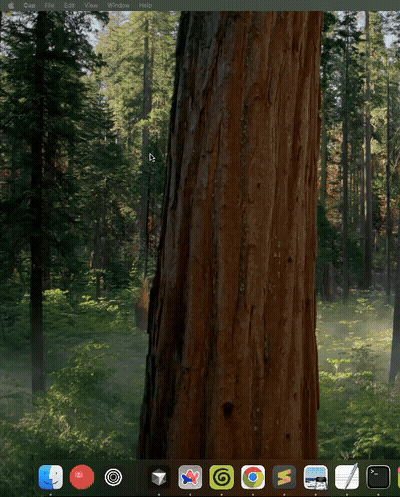

# Bad Dock

Playing Bad Apple (or any video) inside a macOS Dock icon — no private APIs, no Xcode, just `swiftc`.



## What is this?

Since macOS Big Sur, all app icons are jailed inside a rounded square ("squircle") mask. This project escapes that jail using Apple's `NSDockTile` API from 2009, then pushes it as far as it can go — ultimately streaming a full video into a tiny Dock icon at 12fps.

The entire app is built from the command line with `swiftc`. No Xcode project, no storyboards, no nib files.

## The journey

### 1. Escaping the squircle
Setting `NSApplication.shared.applicationIconImage` at runtime bypasses the squircle mask. The Dock renders whatever image you give it — no rounded square clipping. However, this only works while the app is running.

### 2. Making it persist when closed
For the custom icon to survive quitting the app, you need a `NSDockTilePlugin` — a tiny dylib bundle that macOS loads into the Dock's own process (`com.apple.dock.external`). It lives in `Contents/PlugIns/` inside the `.app` bundle and runs independently.

### 3. Finding the max bounds
We built a manual scale tester (+ / - buttons) with a red border overlay to find where macOS clips. The squircle is inscribed within the tile's square bounds:

| Scale | Result |
|-------|--------|
| 1.0x  | Fills the squircle shape |
| 1.1x  | Mostly fills the square, corners still visible |
| 1.2x  | Completely fills the square tile |
| >1.2x | Clipped, no visual change |

**1.2x is the effective max.** The ~20% extra covers the rounded corners.

### 4. Animating the icon
The Dock redraws the tile on every `dockTile.display()` call. We ran a `Timer` at 30fps and built a bouncing ball with physics — gravity, squish on impact, bounce damping, and a dynamic shadow. It worked smoothly.

Key gotcha discovered: using `applicationIconImage` and `dockTile.contentView` simultaneously causes **flickering**. Stick to one method — `contentView` is better for animation.

### 5. Playing Bad Apple in the Dock

The final boss. The challenge was streaming a 5.5 minute video into a Dock icon without killing memory or dropping frames.

**Attempt 1 — Preload all frames into memory:** Extracted every frame with `AVAssetReader`, converted to `NSImage`, stored in an array. Worked briefly then crashed — ~3,900 frames of 128x128 images ate all available RAM.

**Attempt 2 — JPEG-compressed frame storage:** Same preload approach but compressed each frame to JPEG bytes (~3-5KB vs ~65KB raw). Better, but still loaded everything before playing and grew memory linearly.

**Attempt 3 — Streaming ring buffer (final):** Producer-consumer pattern with a 60-frame ring buffer (~5 seconds ahead). Background thread decodes frames with `AVAssetReader` + `CIContext`, compresses to JPEG, and pushes into the buffer. The main thread pops and renders at 12fps. Frames are freed immediately after display. When the video ends, the producer restarts from the beginning for seamless looping. Memory stays flat at ~80MB.

Other things we figured out along the way:
- **Crop to fill** instead of letterboxing — the 4:3 video had black bars in a square tile until we flipped the aspect ratio scaling to fill and clip rather than fit
- **Reuse `CIContext`** — creating one per frame caused significant overhead
- **Every 2nd frame** is enough — extracting at half the source framerate (12fps from 24fps source) looks smooth at Dock icon size
- **Ad-hoc code signing** is required for macOS to respect the app bundle's icon and plugin

## Building

No Xcode required — just `swiftc` and the command line.

```bash
# Create the .app bundle structure
mkdir -p BadDock.app/Contents/MacOS
mkdir -p BadDock.app/Contents/Resources
mkdir -p BadDock.app/Contents/PlugIns/DockPlugin.docktileplugin/Contents/MacOS

# Compile the app
swiftc -parse-as-library -o BadDock.app/Contents/MacOS/BadDock BadDock.swift \
    -framework SwiftUI -framework AppKit -framework AVFoundation -framework CoreImage

# Compile the dock tile plugin
swiftc -parse-as-library -module-name DockPlugin DockPlugin.swift \
    -o BadDock.app/Contents/PlugIns/DockPlugin.docktileplugin/Contents/MacOS/DockPlugin \
    -Xlinker -dylib -Xlinker -undefined -Xlinker suppress -Xlinker -flat_namespace \
    -framework AppKit

# Copy the video into Resources
cp badapple.mp4 BadDock.app/Contents/Resources/

# Code sign
codesign --force --sign - BadDock.app/Contents/PlugIns/DockPlugin.docktileplugin
codesign --force --deep --sign - BadDock.app

# Register and launch
/System/Library/Frameworks/CoreServices.framework/Frameworks/LaunchServices.framework/Support/lsregister -f BadDock.app
open BadDock.app
```

## Files

- `BadDock.swift` — SwiftUI app that streams video into the Dock icon via a ring buffer
- `DockPlugin.swift` — `NSDockTilePlugin` for persistent custom icon when app is closed
- `GenIcon.swift` — CoreGraphics script that generates a calculator icon
- `GenBall.swift` — CoreGraphics script that generates a red rubber ball icon
- `badapple.mp4` — The video file (Bad Apple)

## Notes

- `NSDockTilePlugin` is **not allowed on the Mac App Store** — direct distribution only
- The `NSDockTile` API has existed since Mac OS X 10.6 Snow Leopard (2009)
- No private frameworks are used — everything is public AppKit/AVFoundation API

## Credit

Inspired by [this r/MacOS post](https://www.reddit.com/r/MacOS/comments/1sgpjx4/cyberduck_has_escaped_squircle_jail_how/) explaining how Cyberduck escapes the squircle jail. See also the [original gist](https://gist.github.com/B1naryN1nja/a4db8eafc64caa4bc3e1849e6dd0b575) by u/B1naryN1nja.
